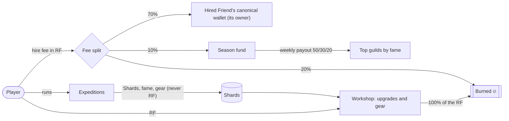

# Friend Guild: economy design

Target category: **Economy Potential**, a token economy paired with $RAREFRIENDS (RF). Everything is
**simulated in the prototype**. No contract is deployed and no RF moves.

## The idea

Every hardwired Generations Friend has its own canonical wallet. Friend Guild gives that wallet a job: other
players **hire the Friend** as a mercenary, and the fee is paid **to the Friend's wallet**. Holders earn from real
demand for their Friend, not from emissions.

## Flows

The diagram above (also drawn in the game's Economy tab):

- **No RF is ever minted.** Every RF a holder earns was paid by another player, and every transaction burns some.
- **Two currencies with separate jobs.** RF moves between players and out of supply. **Shards** pace progression
  and are never redeemable for RF, so they need no backing and can be tuned freely.
- **The sink drives the burn.** Shards are only useful combined with RF in the workshop, so the more players
  progress, the more RF they burn.

## Pricing

- **Base fee:** `1 + 0.22 × rating` RF. Rating is the sum of four stats set by family and seed, plus gear.
- **Demand multiplier:** `1.05^h`, where `h` is the hires still in the demand window. It decays continuously: half-life of 1 day in production, 2 minutes on the demo clock.
- **Why dynamic pricing:** popular Friends get pricier, which pushes players to cheaper alternatives. In the simulator this spreads earnings across the collection: the top 10% of Friends take about 15% of owner earnings with default settings. It also makes self-hiring expensive: every self-hire raises the price of the next one.
- **Affinity:** each zone favours two counter-families, so no single family is best everywhere. Demand follows the rotating zones.
- **Gear:** crafting burns RF and raises your Friend's rating, and with it the fee other guilds pay. It's a player-funded investment in your own Friend's earning power.

## The flywheel

1. Players hire Friends to run expeditions: RF goes to holders and 20% is burned.
2. Holders earn in proportion to real demand, so hardwired Friends become productive assets.
3. More reason to hardwire Friends and to upgrade them, and both spend RF.
4. More listed Friends give more choice and lower prices, which brings more players back to step 1.

## Simulator results (default parameters, Baseline)

1,000 players (2% join and 2% leave each day), 3 expeditions a day, 30 days. Reproducible in the Economy tab
(seed 42, **Baseline** preset).

| Metric | Value |
| --- | ---: |
| RF spent | ≈ 2.25M |
| RF burned | ≈ 713K (hire burns plus workshop burns) |
| RF to Friend owners | ≈ 1.34M |
| Average listed Friend earns | ≈ 56 RF/day (an average player spends ≈ 75 RF/day) |
| Average fee, day 1 → day 30 | 7.7 → 10.9 RF (demand settles) |
| Top 10% of Friends' share of owner earnings | ≈ 15% |
| Shards held per active player | levels off at about 115 |
| RF minted by the game | **0** (conservation check passes) |

Absolute volumes scale with player count and the fee level, which is a launch parameter. The ratios are what
matter: about a third of all RF spent is burned, and about 60% goes to holders.

## Scenarios

Presets in the Economy tab. Each sets the parameters below on top of the defaults (the chosen player count is kept),
runs 30 days, and prints a one-line reading computed from the results. Numbers for 1,000 players, seed 42:

| Preset | Parameters | Result (as printed in the game) |
| --- | --- | --- |
| Baseline | defaults | 713,375 RF burned (32% of all RF spent); an average listed Friend earned 56 RF/day. |
| Bear market | 0.5% join, 3.5% leave per day (net −3%), 2 expeditions a day | Players 1,000 → 413; daily burn peaked at 12,946 RF on day 5, then fell to 6,314 by day 30 (−51%). The listed pool shrinks with players, so a listed Friend still earns 31.4 → 32 RF/day (day 7 → 30). |
| Hype | 7% join, 2% leave per day (net +5%) | Players 1,000 → 4,115; daily burn 30,981 RF on day 7 → 96,351 on day 30. New players arrive with no Shards, yet a listed Friend still earns 54.7 RF/day. |
| Whales | 5% of players run 4× more expeditions | 5% of players spent 17% of all RF; the top 10% of Friends took 14% of owner earnings; 69.3 RF/day per listed Friend. |
| Bot attack | 5% of guilds are bots spending 150 RF/day hiring their own Friend; hire cap 3 per Friend per day | 50 bots made 4,500 self-hires, spent 58,537 RF and lost 30% of it (11,707 RF burned, 5,854 RF to the season). Their pumped price cut real hires of their Friends by 17% vs an average Friend. Without the cap: 12,922 self-hires costing 209,658 RF (the cap cuts wash volume 65%). |

**Reading the bot attack.** A self-hire returns only the owner's 70%: the 20% burn and 10% season share are lost on
every fee, so wash trading is always net-negative for the attacker. It also backfires: each self-hire raises the
bot's own fee by 5%, so real guilds pick its Friend less. The hire cap bounds how many hires one guild can buy from
the same Friend in a day, which caps the stats a bot can farm (hire counts) regardless of its budget.

## Edge cases and abuse

- **Self-hiring to farm stats:** it always costs the 20% burn and 10% to the season, and pumps the Friend's own
  price. A daily hire cap (one guild can hire the same Friend at most 3 times a day) limits wash volume. See the
  Bot attack scenario above. Sybil guilds spreading the wash across many accounts still pay 30% on every fee; a
  per-Friend daily cap across all guilds is the next lever if needed.
- **Cold start:** tavern NPC mercenaries have a fixed fee paid 100% to the season fund. They fill the board until
  enough real Friends are listed.
- **Concentration:** dynamic pricing plus zone affinity spread demand. The season fund rewards guild play, not
  holdings.
- **Price spikes:** the multiplier decays daily, and players can always pick a cheaper Friend from the board.

## Going live (later phase, with the Rare Friends team)

Needs custom integration beyond FriendSDK v0.1.4, which has no hire, listing, extra-currency or persistence APIs:

- **GuildHire contract** (RF and Generations through interfaces):
  - `list(friendId, on)` is callable by the Friend's owner;
  - `hire(friendId, maxFee)` sends 70% to the Friend's canonical wallet, burns 20% and adds 10% to the season;
  - `seasonClaim(...)` pays the season winners.
- **Game server** for Shards, fame and expedition results. These are off-chain soft state, with no RF payout, so
  no prize reserve is needed. The season fund pays by fame, which the server attests, with a challenge window
  before payout.
- **Runtime:** hire and upgrade confirmations through the SDK's trusted confirmation UI. Game code never sees a
  signer.
- **Compliance:** passive earnings for NFT holders could draw securities-style scrutiny in some jurisdictions.
  Framing it as payment for in-game services, plus legal review, comes before launch.

## Assumptions (stated, tunable)

- Hiring behaviour: value for money with noise, 10% prestige picks, 8-Friend boards.
- Shards: 20–40 per expedition, half of the balance spent daily in the workshop.
- Demand halves daily. Listed Friends = 80% of players: the listed pool grows and shrinks with the player count
  (new holders list new Friends; when players leave, random Friends are delisted).
- **Growth and churn:** each day, `growthPct`% of active players join (with no Shards) and `churnPct`% leave (their
  Shards leave circulation). Fractions carry over between days. Defaults 2% and 2%.
- **Whales:** `whaleShare` of players run `whaleMult`× the expeditions (default 0, preset 5% × 4).
- **Bots:** `botShare` of the starting guilds are bots that spend `botBudget` RF a day hiring their own Friend, as
  many times as the price and the hire cap allow. They run no expeditions and don't churn.
- **Hire cap:** `hireCap` = most hires of one Friend by one guild in a day (default 3, 0 = none). It rarely binds
  for real players, who pick from random boards.
- "Earned per listed Friend" counts owner income from real hires only (self-hires are the bot's own money coming
  back).
