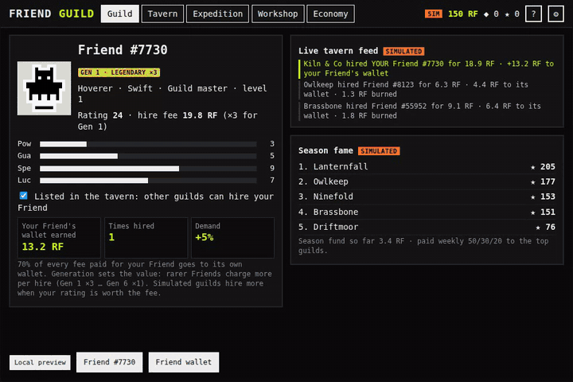

# Friend Guild



<sub>Demo recorded with the SDK test fixtures (mock wallet and sample artwork), so the tavern Friends share two sample sprites. The public preview reads real Friends.</sub>

Builder: Fablizio · [GitHub @Fablizio](https://github.com/Fablizio) · [X @FabrizioCottone](https://x.com/FabrizioCottone) · [Telegram @Fablizio](https://t.me/Fablizio) · FriendSDK **v0.1.4** · Rare Friends Vibeathon (**Economy Potential**)

A guild-management game where Rare Friends work for each other. Your verified Generations Friend runs a guild and
hires real Friends as mercenaries for expeditions. **Every fee pays the hired Friend's own wallet (70%), burns 20%
and funds the weekly season (10%).** Expeditions never create RF. They bring Shards, a soft currency that is
spent, together with RF (burned), on upgrades and gear. An in-game **economy simulator** runs the whole economy
for 30 days with adjustable parameters. **All RF, balances, hires, other guilds and earnings are simulated.**
Full design: [ECONOMY.md](ECONOMY.md).

## Run it

From the repository root (Node.js 22+):

```sh
npm ci
npm run build
npm run dev:game -- games/friend-guild
```

Open `http://localhost:4173`, connect a wallet on **Robinhood mainnet (4663)** holding a hardwired Generations
Friend (generation ≥ 1) and select it. The SDK runtime handles connection, selection and the fresh ownership
check. No transaction or signature is requested. Static build: `npx friendsdk build games/friend-guild`.

## How to play

Tap or click. Everything is also reachable with the keyboard (Tab / Enter).

- **Guild:** your Friend's stats (from its family and seed), rating, hire fee and gear.
  - Toggle **Listed in the tavern** to let other (simulated) guilds hire it. 70% of each fee lands in your Friend's wallet.
  - The live feed shows every hire across the tavern, and the season board ranks guilds by fame.
- **Tavern:** eight real Friends with stats, family trait and current fee.
  - Hire up to 2 for your next expedition. Each hire raises that Friend's price by 5%, and demand fades over time (half-life of 2 minutes on the demo clock).
  - **Refresh board** shows other Friends.
- **Expedition:** pick one of four family zones (tier 1–4). Each zone favours two counter-families (+7% each).
  - Success chance comes from team power, guild level and affinity, and is shown before launch.
  - The run plays out as a short animation with four encounters against real Friends (12–24 s demo speed, **Skip** available).
  - Rewards: Shards, fame and sometimes gear. **Never RF.**
- **Workshop:**
  - Guild upgrade: level L costs ◆ 40·L + 8·L RF, and gives +3% success per level, up to level 5.
  - Craft gear: ◆ 30 + 4 RF for +2 to one stat. Up to 3 items equipped.
  - **All workshop RF is burned.** Gear raises your Friend's rating, and with it its hire fee.
  - A table shows where your session's RF went.
- **Economy:** the 30-day agent-based simulator with scenario presets (see below). A small diagram shows where RF goes.

Settings include **Mute** and **Reduce motion** (still frames, no scrolling). Everything pauses while the runtime's
menus are open.

## Economy terms (simulated)

| | |
| --- | --- |
| Starting balance | 150 RF (simulated, per session) |
| Mercenary fee | (1 + 0.22 × rating) RF × 1.05^recent hires, rounded to 0.1 |
| Fee split | **70% hired Friend's wallet · 20% burned · 10% season fund** |
| Guild upgrade | ◆ 40·L + 8·L RF (RF 100% burned) |
| Gear craft | ◆ 30 + 4 RF (RF 100% burned) |
| Expedition rewards | Shards (◆), fame, occasional gear. **No RF** |
| Season fund | Paid weekly 50/30/20 to the top guilds by fame (simulated) |

- **No redemption:** Shards and gear are never redeemable for RF, so no prize backing applies. The game mints no RF.
- **Chance-game API:** this prototype does not use the SDK chance-game actions. The required `game.json` carries
  **unused schema-only terms** (1 RF, a single 10,000 bps reward of 1 RF, both `1000000000000000000` base units).

## Economy simulator

In-game **Economy** tab and `engine/econ.ts`:
- **Model:** players run expeditions each day and hire two mercenaries from random 8-Friend boards by value for money (10% pick on prestige). They spend half their Shards in the workshop, which burns RF. Fees rise 5% per hire and demand halves daily. Players join and leave every day; new players start with no Shards, and the listed-Friend pool (80% of players) grows and shrinks with them.
- **Scenario presets** (buttons): **Baseline**, **Bear market** (net −3% players a day, 2 expeditions), **Hype** (net +5% a day), **Whales** (5% of players run 4× the expeditions), **Bot attack** (5% of guilds spend 150 RF a day hiring their own Friend, against a hire cap of 3 per Friend per day). Under the charts, a one-line reading is computed from the run. Results for 1,000 players are in [ECONOMY.md](ECONOMY.md#scenarios).
- **Charts** (one series and one axis each, hover values): active players, RF burned per day, RF earned per listed Friend per day, cumulative RF to owners, average fee, and Shards held per active player.
- **Tiles:** RF spent, burned, paid to owners, what an average listed Friend earns per day (and what a player spends), active players at the start and end, the top-10% share of owner earnings, and "RF minted: 0" with a conservation check.
- **Parameters:** players, join and leave % per day, expeditions per day, whale share, bot share, hire cap, burn %, owner %, price step.

## Checks

Run from the repository root:

- `npx tsc -p games/friend-guild/tsconfig.json` (strict) and `npx friendsdk check games/friend-guild` (valid).
- `node games/friend-guild/tests/run-econ.mjs`: 15 checks.
  - Fee splits and the ledger conserve RF.
  - The 30-day model conserves RF, never mints it and is deterministic, also with growth and churn.
  - Growth and churn move the player count, and the listed pool follows (80% of players).
  - New players start with no Shards; churned players take theirs out of circulation.
  - Every scenario preset runs, conserves RF and prints a summary with real numbers.
  - Bot attack: self-hires return exactly 70%, so attackers lose the 30% burn + season share, and their Friends earn less from real hires than average.
  - The hire cap limits wash volume (cap 1 < cap 3 < half of no cap).
  - Whales spend more than their headcount share; a higher burn share burns more; the top 10% of Friends earn well under half; Shard supply stays bounded.
- `CHROME_PATH=<chromium> node games/friend-guild/tests/browser.mjs`: the real SDK runtime in headless Chromium with SDK mock fixtures (extended for the artwork registry). It walks guild → hire two → launch → skip → result → workshop → economy → Bot attack and Hype presets on desktop and phone layouts, with no browser errors.
- `node games/friend-guild/tests/demo-gif.mjs` records `media/demo.gif` with the same fixtures (needs ffmpeg).
- Known issue: the stock `npx friendsdk test` fixture only answers artwork reads for sample Friend #7730, so it rejects the tavern's roster reads by design.

## Limitations

- **Simulated agents:** other guilds, their hires of your Friend and their fame are simulated in the browser. Hires are non-exclusive: a Friend can be on several contracts at once.
- **No persistence:** the sandbox has no storage and the SDK has no save API, so the session resets on reload.
- **Model scope:** the simulator is a model, not a forecast. Player behaviour, prices, demand, growth, churn, whales and bots are assumptions listed in ECONOMY.md. Bots in the model use one guild each; a Sybil attack across many guilds is not modelled.
- **Simulation time:** with 5,000 players the Hype preset grows to about 20,000 players and takes a couple of seconds to run in the browser.
- **RPC dependency:** tavern Friends come from the public Robinhood RPC. If artwork can't be read, the game shows Retry.

## Credits

Code and design by Fablizio (AI-assisted). Scenery is drawn in code. Character art: canonical Rare Friends Generations
sprites via the FriendSDK sprite reader. Sounds come from the FriendSDK sound kit (see `NOTICE.md`). Shares
Friend-loading code with the builder's other entries, *The Binding of RareFriend* and *Daily Crypt*.
